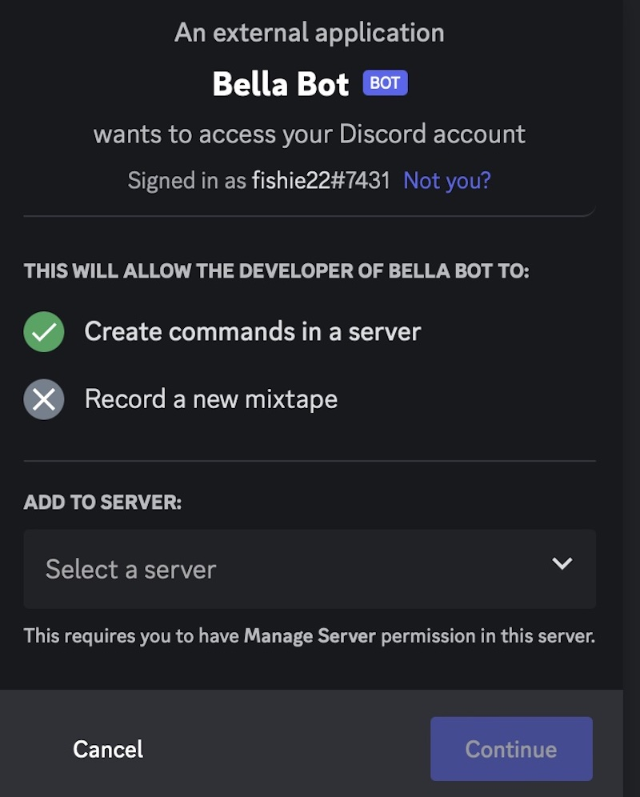

# Toy Discord Bot

## Youtube tutorials
- [Coding Train Discord Bot tutorials](https://thecodingtrain.com/learning/bots/discord/06-command-handler.html)
- [Coding Train Livestream](https://www.youtube.com/watch?v=F3Q4Cf9OZSw)
- [Jishan Kharbanda Youtube tutorial](https://www.youtube.com/watch?v=DdzQTJ1AkKA&list=PLApYoRlzhXgxGJMDpCSFQedwLES6C-3xg)

## Resources
- [Coding Train Discord Bot Choo Choo](https://github.com/CodingTrain/Discord-Bot-Choo-Choo) 
- [Discord Guide](https://discordjs.guide/#before-you-begin) 

## Install dependencies
- `npm install discord.js`
- `npm install dotenv`
- `npm install undici` or `npm install node-fetch`
- `npm install canvas` or `npm install @napi-rs/canvas` (for Macs with M1 chips)
 
## Adding your bot

1.  Click on Advanced.  Toggle Developer Mode, click on link to Discord API

2.  Click on Application and fill in info to create new Application.  (Good idea to unclick public so other people can't add your bot to servers.)

3.  Click on Bot and add bot to the Application
4.  Click on Oauth
5.  Click on URL generator and give the bot scopes and permissions.
6.  For SCOPES, select bot and applications.commands.  For BOT PERMISSSIONS, I have selected Send Messages and Use Slash Commands

7.  Copy the Generated URL and open up a browser window and paste in the URL. 

8.  Add the bot to a server.  Note that you must have permission to add the bot to the server.

9.  Getting the bot token.  In Developer portal, Click on bot and then Reset Token.  Copy the token and paste in .env file

## Running the bot

- `node deply-commands.js` 
- `node index.js`

## .env variables

- token -- see above
- clientId is bot id -- right click on bot and scroll to bottom to COPYID
- guildId is server id -- right click on server and scroll to bottom to COPYID

## Important Changes

-  You must add intents:  I am adding Guilds intents
- `const client = new Client({ intents: [GatewayIntentBits.Guilds] });`

- Syntax changes
- `message` has been changed to `interaction`

- I am using some built-in classes:
- `SlashCommandBuilder` to add command modules
- `EmbedBuilder` to add embeds (random.js)
- `AttachmentBuilder` to add attachments (random.js)

## Adding slash commands using the SlashCommandBuilder

- The name of the file is the name of the slash command, for example for `choochoo.js`

`const { SlashCommandBuilder } = require('discord.js');  
const replies = ["🚂🌈💖", "Choo choo!", "Ding! 🛎", "Never forget this dot!"];  
module.exports = {   
	data: new SlashCommandBuilder()  
		.setName('choochoo')  
		.setDescription('Replies with emogies!'),   
	async execute(interaction) {   
    const index = Math.floor(Math.random() * replies.length);   
		await interaction.reply({ content: replies[index], ephemeral: true });   
	},  
};
`

## Connecting to Tenor 

- [Tenor](https://tenor.com) 
- [Tenor API guide](https://developers.google.com/tenor/guides/quickstart)
- [Migrating from v1 to v2](https://developers.google.com/tenor/guides/migrate-from-v1)
- [Updated URL](https://tenor.googleapis.com/v2/search?q=${kewords}&key=API_KEY&client_key=my_test_app&limit=8)

- I am not positive whether a client key is now required or whether it is just suggested.  I am including the clientId.
- I am getting an error when I try to use the /gif command.  I don't think I am connecting to the Tenor site, but I am not sure why.

##  Breaking changes when upgrading to v14

[Breaking_Changes](https://stackoverflow.com/questions/73028854/discord-js-v13-code-breaks-when-upgrading-to-v14
)

## Adding custom emoji

- You must reference the the number string associated with the emoji.  If you have custom emoji, you can find the number by typing \ and the emoji.  I have added a custom emoji called mandelbulb which is stored as the  object <:mandelbulb:1066437493827834008>.  To add it as an option, I would write:
`emoji: '1066437493827834008'`.  I believe that you have access to custom emojis written in servers you belong to, but I am not sure about others.