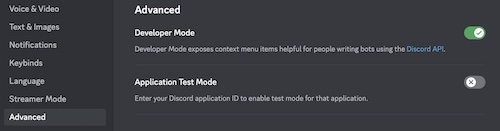
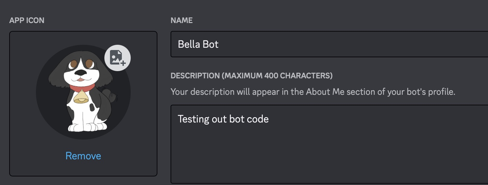

# Toy Discord Bot

## Youtube tutorials
- [Coding Train Discord Bot tutorials](https://thecodingtrain.com/learning/bots/discord/06-command-handler.html)
- [Coding Train Livestream](https://www.youtube.com/watch?v=F3Q4Cf9OZSw)
- [Jishan Kharbanda Youtube tutorial](https://www.youtube.com/watch?v=DdzQTJ1AkKA&list=PLApYoRlzhXgxGJMDpCSFQedwLES6C-3xg)

## Resources
- [Coding Train Discord Bot Choo Choo](https://github.com/CodingTrain/Discord-Bot-Choo-Choo) 
- [Discord Guide](https://discordjs.guide/#before-you-begin) 

## Websites
- [Tenor](https://tenor.com) 

## Install dependencies
- `npm install discord.js`
- `npm install dotenv`
- `npm install undici` or `npm install node-fetch`
- `npm install canvas` or `npm install @napi-rs/canvas` (for Macs with M1 chips)
 
## Adding your bot

1.  Click on Advanced.  Toggle Developer Mode, click on link to Discord API

2.  Click on Application and fill in info to create new Application.  (Good idea to unclick public so other people can't add your bot to servers.)

3.  Click on Bot and add bot to the Application
4.  Click on Oauth
5.  Click on URL generator and give the bot scopes and permissions.
6.  For SCOPES, select bot and applications.commands.  For BOT PERMISSSIONS, I have selected Send Messages and Use Slash Commands

7.  Copy the Generated URL and open up a browser window and paste in the URL. 

8.  Add the bot to a server.  Note that you must have permission to add the bot to the server.

## Running the bot

- `node deply-commands.js` 
- `node index.js`

## .env variables

- bot id is clientId 
- server id is guildId

## Important Changes

-  You must add intents:  I am adding Guilds intents
- `const client = new Client({ intents: [GatewayIntentBits.Guilds] });`

- Syntax changes
- `message` has been changed to `interaction`

- I am using some built-in classes:
- SlashCommandBuilder to add command modules
- EmbedBuilder to add embeds (random.js)
- AttachmentBuilder to add attachments (random.js)

## Adding slash commands using the SlashCommandBuilder

- The name of the file is the name of the slash command, for example for `choochoo.js`
`const { SlashCommandBuilder } = require('discord.js');`
`const replies = ["🚂🌈💖", "Choo choo!", "Ding! 🛎", "Never forget this dot!"];`
`module.exports = {
	data: new SlashCommandBuilder()
		.setName('choochoo')
		.setDescription('Replies with emogies!'),
	async execute(interaction) {
    const index = Math.floor(Math.random() * replies.length);
		await interaction.reply({ content: replies[index], ephemeral: true });
	},
};
`

